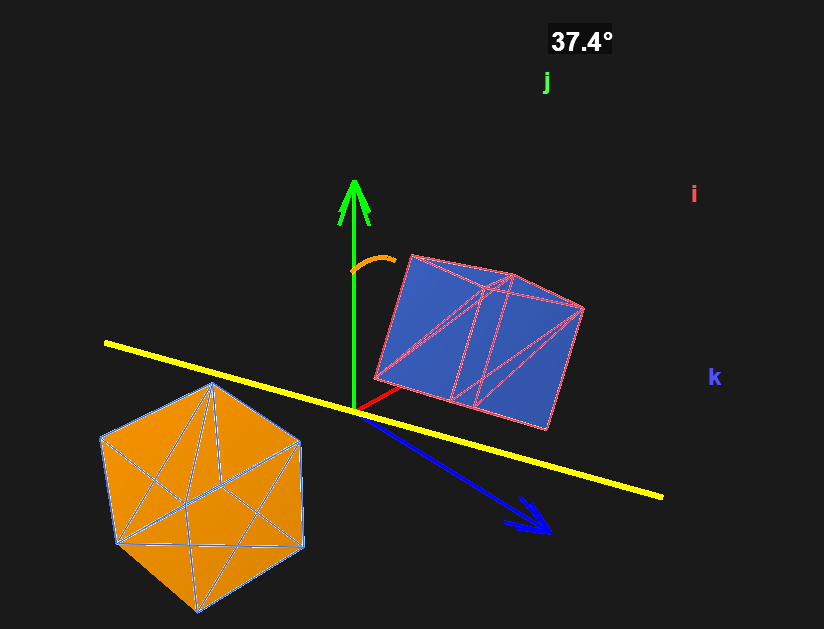
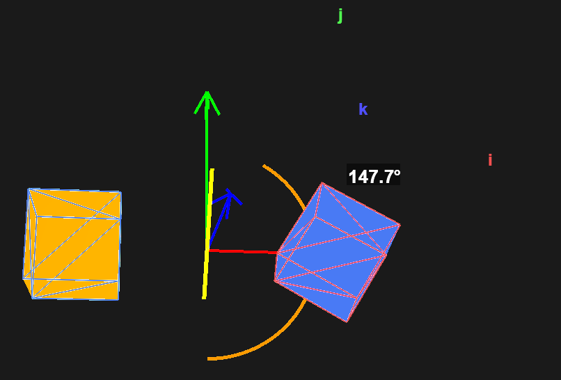

# 13523156-seleksiIRK-Quaternion-Visualizer

## Deskripsi Program

Quaternion Visualizer adalah aplikasi desktop berbasis GUI yang dirancang untuk memvisualisasikan rotasi objek 3D menggunakan quaternion, euler angle, tait-bryan, dan exponential map. Program ini memungkinkan pengguna untuk memahami konsep rotasi 3D melalui visualisasi interaktif yang komprehensif.

## Fitur Program

- **Input Objek 3D**: Mendukung file berformat .obj (cube, teapot, sphere, pyramid)
- **Input Axis Rotasi**: Dalam bentuk unit quaternion (w, x, y, z)
- **Input Sudut Rotasi**: Dalam derajat dengan kontrol slider dan input manual
- **Visualisasi Dual Object**: Menampilkan objek sebelum (biru) dan sesudah rotasi (merah)
- **Visualisasi Axis Rotasi**: Garis kuning tebal menunjukkan sumbu rotasi
- **Dual Renderer**: OpenGL renderer dan Custom renderer (bonus 2)
- **Kontrol Kamera Interaktif**: Zoom, rotate, dan pan dengan mouse
- **4 Jenis metode rotasi**: Quaternion, Euler Angle, Tait-Bryan, Exponential Map (bonus 1)
- **Reset Kamera**: Tombol untuk reset posisi kamera ke default

## Teknologi dan Framework

### Bahasa Pemrograman
- **Python 3.8+**

### Framework
- **PySide6 (Qt6)**
- **QtWidgets**
- **QtCore**
- **QtGui**
- **PyOpenGL 3.1.6+**
- **PyOpenGL-accelerate**

### Penjelasan Quaternion
Quaternion adalah ekstensi dari bilangan kompleks yang terdiri dari satu bagian real (w) dan tiga bagian imaginer (x, y, z). Dalam konteks rotasi 3D, quaternion dinyatakan sebagai:

```
q = w + xi + yj + zk
```

Dengan:
- **w**: Komponen skalar (real)
- **x, y, z**: Komponen vektor (imaginer)
- **i, j, k**: Unit imaginer dengan sifat i² = j² = k² = ijk = -1

Untuk merepresentasikan rotasi dengan sudut θ terhadap axis (ax, ay, az):

```
q.w = cos(θ/2)
q.x = ax * sin(θ/2)
q.y = ay * sin(θ/2)
q.z = az * sin(θ/2)
```

Unit quaternion (magnitude = 1) digunakan untuk rotasi:
```
|q| = √(w² + x² + y² + z²) = 1
```

### Kegunaan Quaternion
- Dalam kehidupan sehari-hari, quaternion digunakan pada kontroler game untuk tracking pergerakan, kamera Hp untuk stabilizer, dan VR untuk tracking gerakan
- Dalam keinformatikaan, quaternion dapat digunakan pada robotics untuk mengontrol orientasi lengan robot dan pada computer vision untuk tracking objek
- Dalam tugas ini, quaternion dapat digunakan untuk menampilkan bagaimana objek 3D berotasi dalam ruang. Keunggulan menggunakan quaternion adalah tidak terjadi gimbal, pergerakan yang smooth dan lebih stabil dibandingkan dengan metode lainnya

## Screenshot Hasil Percobaan

Berikut adalah hasil screenshot dari berbagai pengujian aplikasi Quaternion Visualizer dengan menggunakan kedua renderer (OpenGL dan Custom) serta berbagai metode rotasi:

### Quaternion Rotation

**OpenGL Renderer:**


**Custom Renderer:**


### Euler Angle Rotation

**OpenGL Renderer:**


**Custom Renderer:**


### Tait-Bryan Rotation

**OpenGL Renderer:**


**Custom Renderer:**


### Exponential Map Rotation

**OpenGL Renderer:**


**Custom Renderer:**


### Penjelasan Visualisasi

Dalam setiap screenshot dapat dilihat:

- **Objek Original (Biru)**: Ditampilkan di sisi kiri, menunjukkan posisi awal objek sebelum rotasi
- **Objek Rotated (Merah)**: Ditampilkan di sisi kanan, menunjukkan hasil setelah rotasi diterapkan
- **Coordinate Axes**: Sumbu koordinat i (merah), j (hijau), k (biru) dengan label yang jelas
- **Rotation Axis**: Garis kuning tebal yang menunjukkan sumbu rotasi
- **Rotation Arc**: Arc berwarna orange yang menunjukkan arah dan besar rotasi
- **Angle Label**: Label derajat yang menampilkan sudut rotasi di sekitar axis

## Cara Menjalankan Program

### Instalasi Dependencies

#### 1. Clone atau Download Repository
```bash
git clone <repository-url>
cd 13523156-seleksiIRK-Quaternion-Visualizer
```

#### 2. Buat Virtual Environment
```bash
python -m venv venv
venv\Scripts\activate
```

#### 3. Install Dependencies
```bash
pip install --upgrade pip
pip install -r requirements.txt
```

### Menjalankan Aplikasi

```bash
py -m src.visualizer.main
```

## Referensi

1. **Software 3D Engine Implementation**  
   https://github.com/StanislavPetrovV/Software_3D_engine?tab=readme-ov-file  
   *Referensi implementasi 3D engine dan rendering pipeline*

2. **Quaternion Visualization and Interactive Learning**  
   https://eater.net/quaternions  
   *Tutorial interaktif untuk memahami quaternion secara visual*

3. **Aljabar Quaternion Bagian 1 - Prof. Rinaldi Munir**  
   https://informatika.stei.itb.ac.id/~rinaldi.munir/AljabarGeometri/2023-2024/Algeo-25-Aljabar-Quaternion-Bagian1-2023.pdf  
   *Materi kuliah tentang dasar-dasar quaternion dan operasinya*

4. **Aljabar Quaternion Bagian 2 - Prof. Rinaldi Munir**  
   https://informatika.stei.itb.ac.id/~rinaldi.munir/AljabarGeometri/2023-2024/Algeo-26-Aljabar-Quaternion-Bagian2-2023.pdf  
   *Materi lanjutan tentang aplikasi quaternion dalam rotasi 3D*